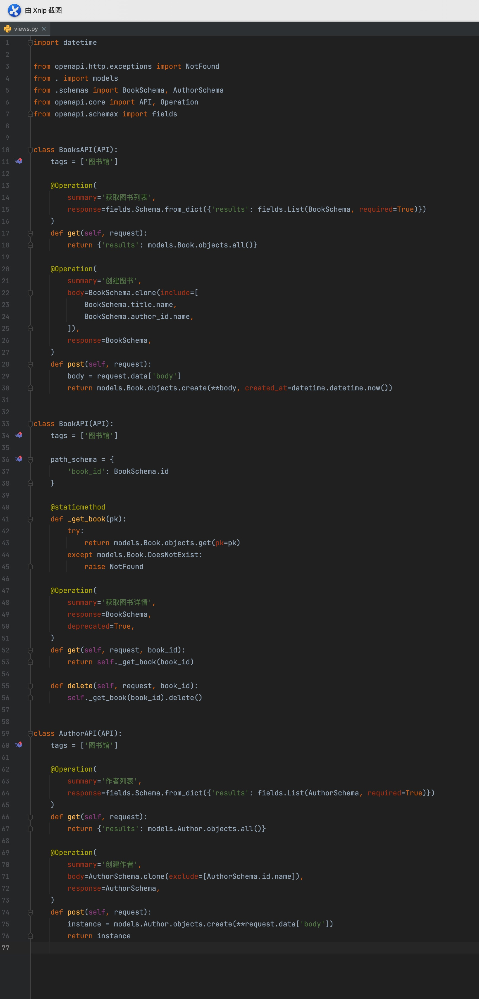
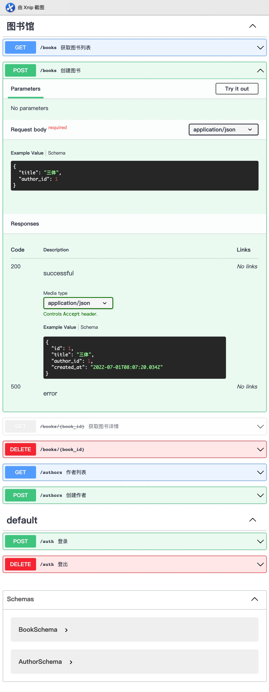

# Django-OpenAPI

  
  

## 待办清单

### 基础

- [x] 基础结构
- [x] 路由注册
- [ ] 身份校验 (401)
- [ ] 权限校验 (403)
- [ ] Content-Type 支持
    - [x] `application/json`
    - [ ] `application/x-www-form-urlencoded`

### Schema

- [x] API结构
- [ ] 各种类型字段序列反序列实现
    - [x] List
    - [x] String
    - [x] Integer
    - [ ] Float
    - [ ] Datetime
    - [ ] Time
    - [ ] Date
    - [ ] Url
    - [ ] Number
    - [ ] Boolean
    - [ ] Email
    - [ ] File
- [ ] 自定义字段
- [ ] 各类验证器

### Specification

- [x] Components Object 自动注册、引用
- [ ] _schema to specification_ (自定义字段？)

### 配置

- [ ] Swagger Info
- [ ] Response Schema (200, 400, 500...)

### 扩展

- [ ] QuerySet 分页
- [ ] Django Model to Schema