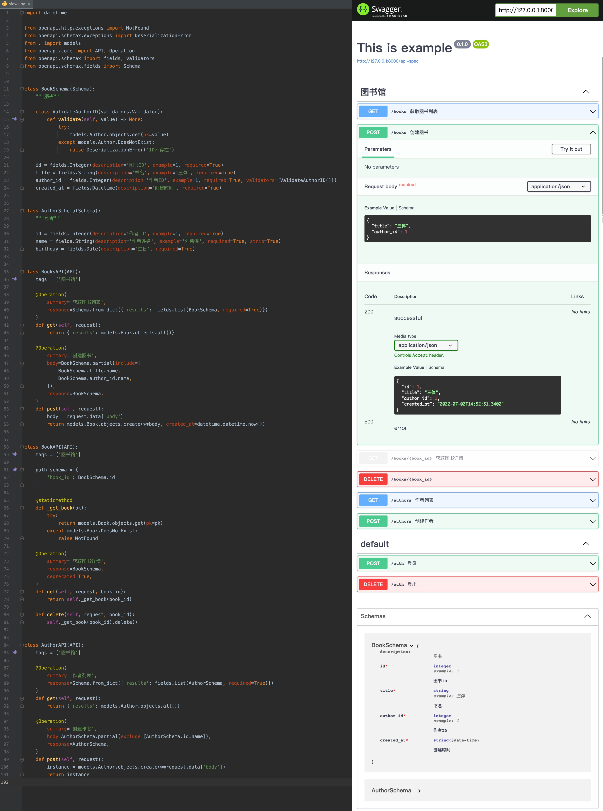

# Django-OpenAPI (开发中...)

通过接口定义，实现文档生成、参数校验、响应数据序列化、API接口自动测试...

[文档地址](https://dog-egg.github.io/django-openapi/)

## 待办清单

### 基础

- [x] 基础结构
- [x] 路由注册
- [ ] 身份校验 (401)
- [ ] 权限校验 (403)
- [x] Request Body Content-Type

### Schema

- [x] API结构
- [x] Schema 字段嵌套
- [x] Schema 字段继承
- [ ] 各种类型字段序列反序列实现
    - [x] List
    - [x] String
    - [x] Integer
    - [x] Float
    - [ ] Datetime
    - [ ] Time
    - [ ] Date
    - [ ] Url
    - [ ] Number
    - [x] Boolean
    - [ ] Email
    - [x] File
- [ ] 自定义字段
- [ ] 各类验证器

### Specification

- [x] Components Object 自动注册、引用
- [ ] _schema to specification_ (自定义字段？)

### 配置

- [ ] Response Schema (200, 400, 500...)

### 扩展

- [ ] QuerySet 分页
- [ ] Django Model to Schema