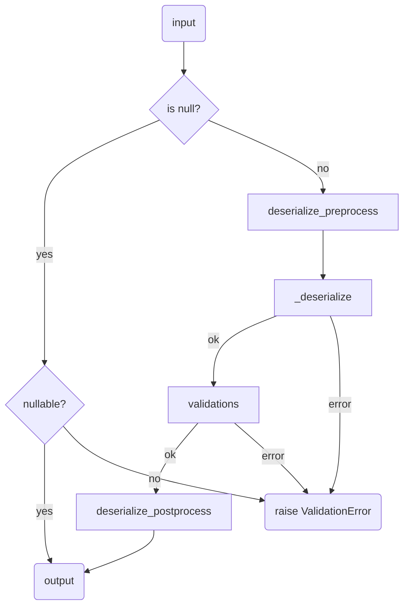
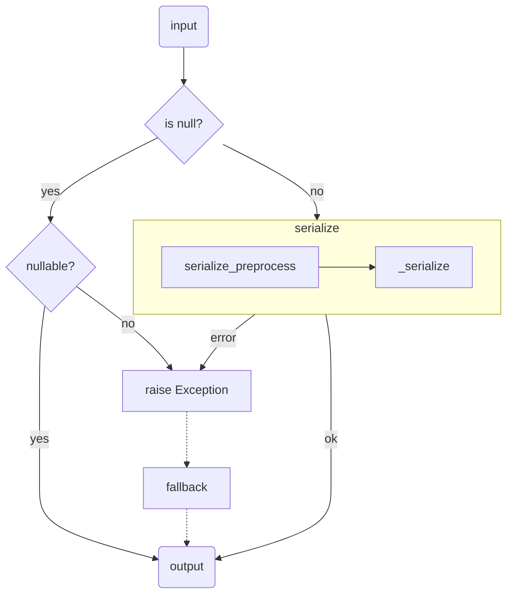

# 流程图

### Schema 反序列 (deserialize)

```mermaid
graph TD
    input(input)
    isnull{is null?}
    nullable{nullable?}
    error(raise ValidationError)
    validate[validations]
    deserialize[_deserialize]
    output(output)

    input --> isnull
    isnull --> |yes|nullable
    isnull --> |no|deserialize_preprocess
    deserialize_preprocess --> deserialize
    nullable --> |yes|output
    nullable --> |no|error
    deserialize --> |ok|validate
    deserialize --> |error|error
    validate --> |ok|deserialize_postprocess
    deserialize_postprocess --> output
    validate --> |error|error
```

### Schema 序列 (serialize)

```mermaid
flowchart TD
    input(input)
    isnull{is null?}
    nullable{nullable?}
    error[raise Exception]
    _serialize[_serialize]
    output(output)
    fallback[fallback]
    serialize_preprocess[serialize_preprocess]

    input --> isnull
    isnull --> |yes|nullable
    isnull --> |no|serialize
    nullable --> |yes|output
    nullable --> |no|error
    serialize --> |ok|output
    serialize --> |error|error
    error -.-> fallback
    fallback -.-> output

    subgraph serialize
        serialize_preprocess --> _serialize
        _serialize
    end
```
